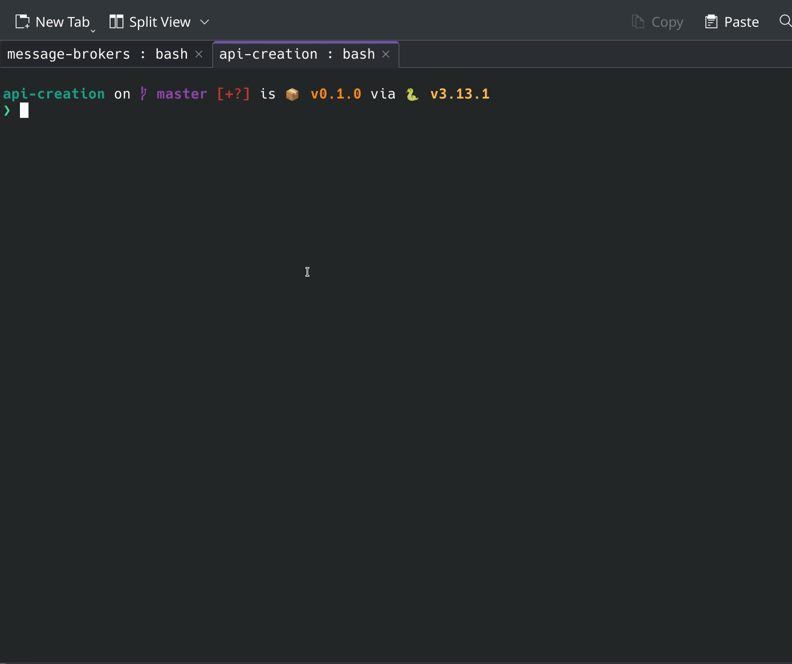

# API Creation

## Prerequisite
### Install `uv` for package and project management 
```shell
# On macOS and Linux.
curl -LsSf https://astral.sh/uv/install.sh | sh
# On Windows.
powershell -ExecutionPolicy ByPass -c "irm https://astral.sh/uv/install.ps1 | iex"
```

## How to Run

### Setup Local Env
```shell
uv run fastapi run src/main.py
```

## Run by Docker

### Build
```shell
docker build -t="api-creation:latest" .
```

### Run
```shell
docker compose up
```

## Directory Structure
```shell
├── docker-compose.yaml # docker compose file
├── Dockerfile
├── pyproject.toml # uv project management file
├── README.md
└── src
    ├── main.py # app file for api service
```

## Code Running Result

